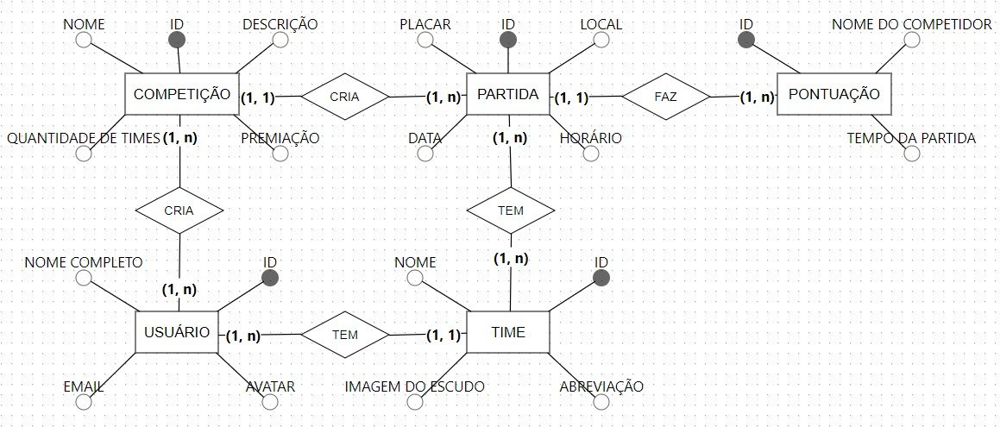

# Documentação

- [Visão Geral](#visão-geral)
- [Entidades](#entidades)
  - [Usuário](#usuário)
  - [Competição](#competição)
  - [Partida](#partida)
  - [Time](#time)
  - [Pontuação](#pontuação)
- [Relacionamentos](#relacionamentos)
- [Diagrama ER](#diagrama-er)

## Visão Geral
Este projeto é um sistema de gerenciamento de maratonas de programação que permite a criação e acompanhamento de competições, partidas, times e pontuações.

## Entidades
### Usuário
Representa um usuário do sistema.
- **ID**: Identificador único do usuário.
- **Nome Completo**: Nome completo do usuário.
- **Email**: Endereço de email do usuário.
- **Avatar**: Imagem de perfil do usuário.

### Competição
Representa uma maratona de programação.
- **ID**: Identificador único da competição.
- **Nome**: Nome da competição.
- **Descrição**: Descrição da competição.
- **Quantidade de Times**: Número de times participantes.
- **Premiação**: Detalhes sobre a premiação.

### Partida
Representa uma partida dentro de uma maratona de programação.
- **ID**: Identificador único da partida.
- **Placar**: Resultado da partida.
- **Data**: Data da partida.
- **Horário**: Horário da partida.
- **Local**: Local onde a partida será realizada.

### Time
Representa um time participante de uma competição.
- **ID**: Identificador único do time.
- **Nome**: Nome do time.
- **Imagem do Escudo**: Imagem do escudo do time.
- **Abreviação**: Abreviação do nome do time.

### Pontuação
Representa a pontuação de um competidor em uma partida.
- **ID**: Identificador único da pontuação.
- **Nome do Competidor**: Nome do competidor.
- **Tempo da Partida**: Tempo registrado para o competidor na partida.

## Relacionamentos
- **Usuário-Cria-Competição**: Um usuário pode criar várias competições. Uma competição é criada por um usuário.
- **Competição-Cria-Partida**: Uma competição pode ter várias partidas. Uma partida pertence a uma competição.
- **Partida-Tem-Time**: Uma partida envolve dois times. Um time pode participar de várias partidas.
- **Partida-Faz-Pontuação**: Uma partida pode ter várias pontuações. Uma pontuação pertence a uma partida.

## Diagrama ER

  
   
  <em>Diagrama de Entidade-Relacionamento (DER) do Marathon</em>

